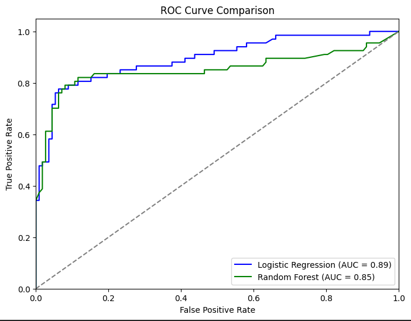

🚀 **Titanic Survival Prediction – ML Model Performance & Insights!** 🎯

I recently worked on the Titanic dataset, applying **Logistic Regression** and **Random Forest Classifier** to predict survival chances with an accuracy of **87%**! 🏆

## 🔍 EDA:
#### 1️⃣ Categorical Features Insights (From Figure 1 - Bar Plots)

Gender Distribution (Sex Bar Plot)
- The number of males are very high than number of females which means more men were onboard
  
Passenger Class (Pclass Bar Plot)
- Most passengers were in 3rd class followed by second class , and the least 1st class this suggest there were more low-income passengers

#### 2️⃣ Numerical Features Insights (From Figure 2 - Scatter Plots & Histograms)

#### Histograms
- Age Distribution
   Age follows a normal-like distribution, with most passengers between 20–40 years old.
   Very few elderly people (above 60) were on board.

- Fare Distribution
   The Fare histogram is highly skewed to the right.
   A few passengers paid very high fares, possibly First-Class passengers.

- Siblings/spouse distribution
  many passengers traveled alone or without immediate family members.


  ### Scatter plots
  - Age vs. Survival
     It appears that younger passengers (around 0–10 years) have a higher chance of survival, as most points corresponding to this age range are clustered around 1 (survived) on the y-axis.
     Older passengers (above 70 years) have fewer survivors in the dataset, shown by the scattered points near 0 (did not survive).

  - Fare vs. Survival
     The plot shows that passengers who paid higher fares (above 200) have a higher likelihood of survival, as they are predominantly clustered at 1 (survived).
     Many passengers with lower fares are spread across both survival and non-survival outcomes, indicating that fare may not have been the sole determinant of survival.

  - SibSp vs. Survival
     Passengers with 0, 1, or 2 siblings/spouses aboard tend to have a higher chance of survival, as they are mostly concentrated at 1 (survived).
    The plot doesn't show a significant relationship for passengers with more siblings/spouses aboard, but it is mostly dominated by values of SibSp = 0 or 1, suggesting that smaller family sizes might have been more likely to survive. 

   - General Insight:
     The visualizations suggest that age, fare, and number of family members played roles in survival probability

#### Heatmaps

    Key Insights from the Heatmap:
    Age and Fare:

    Correlation: 0.10 (Weak Positive Correlation)
    There is a weak positive correlation between Age and Fare, which means that as age increases, fare tends to increase slightly. However, this relationship is not strong.
    
    Age and SibSp:
    Correlation: -0.31 (Weak Negative Correlation)
    There is a weak negative correlation between Age and SibSp. This suggests that younger passengers are somewhat more likely to have more siblings/spouses aboard, though the relationship is weak.

    Age and Parch:
    Correlation: -0.19 (Weak Negative Correlation)
    There is a weak negative correlation between Age and Parch, meaning that younger passengers might have had slightly more parents/children aboard, but again, the correlation is weak.

    Fare and SibSp:
    Correlation: 0.16 (Weak Positive Correlation)
    The weak positive correlation between Fare and SibSp suggests that passengers who paid a slightly higher fare tended to have a few more siblings/spouses aboard, but the correlation is not strong.

    Fare and Parch:
    Correlation: 0.22 (Weak Positive Correlation)
    A weak positive correlation between Fare and Parch indicates that passengers who paid more for their ticket might have had slightly more parents/children aboard.

    SibSp and Parch:
    Correlation: 0.41 (Moderate Positive Correlation)
    This is a moderate positive correlation, suggesting that passengers who had more siblings/spouses aboard also tended to have more parents/children aboard, likely indicating family groups.
    
    Conclusion:
    Age does not seem to have strong correlations with the other variables.
    Fare has weak positive correlations with both SibSp and Parch, indicating that wealthier passengers might have traveled with more family members.
    The SibSp and Parch variables are moderately correlated, suggesting that family groups with multiple siblings/spouses also tended to have more parents/children aboard.


    
## 🔍 Key Learnings:
✅ **Feature Engineering** – Handling missing values, encoding categorical features, and scaling data.
✅ **Model Selection & Hyperparameter Tuning** – Optimizing parameters for improved performance using GridSearchCV.
✅ **Performance Metrics** – ROC Curve & AUC comparison to evaluate models effectively.

## 🔧 Hyperparameter Tuning
To improve model performance, I used **GridSearchCV** for hyperparameter tuning:
```python
from sklearn.model_selection import GridSearchCV
from sklearn.ensemble import RandomForestClassifier

param_grid = {
    'n_estimators': [100, 200, 300],
    'max_depth': [None, 10, 20],
    'min_samples_split': [2, 5, 10],
    'min_samples_leaf': [1, 2, 4]
}

rf = RandomForestClassifier()
grid_search = GridSearchCV(rf, param_grid, cv=5, scoring='accuracy')
grid_search.fit(X_train, y_train)
print("Best Parameters:", grid_search.best_params_)
```
make 
## 📊 Model Evaluation
### ROC Curve Comparison
(Logistic Regression AUC: 0.89, Random Forest AUC: 0.85)


### 🆚 Model Accuracy Scores
(Which model performed better? See below! 👇)


## 🏗 Model Training Code
Here’s the training process for **Logistic Regression**:
```python
from sklearn.linear_model import LogisticRegression

logreg = LogisticRegression()
logreg.fit(X_train, y_train)
y_pred = logreg.predict(X_test)
```
And for **Random Forest Classifier**:
```python
best_rf = grid_search.best_estimator_
best_rf.fit(X_train, y_train)
y_pred_rf = best_rf.predict(X_test)
```

🔗 **[**
🔗 **[**

This project strengthened my skills in classification modeling, feature engineering, and model evaluation. 🚀 Looking forward to applying these techniques to more datasets!

Would love to hear your thoughts! How do you approach model evaluation in classification tasks? Let’s discuss in the comments! 👇

#MachineLearning #DataScience #TitanicDataset #FeatureEngineering #ModelEvaluation #AI #ML
